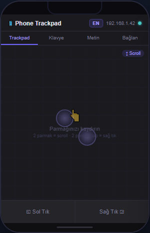
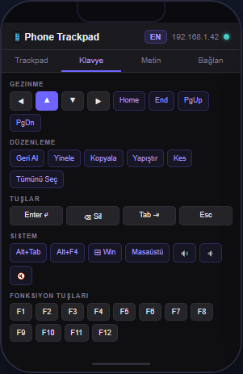
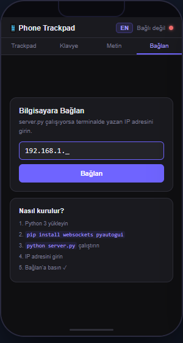
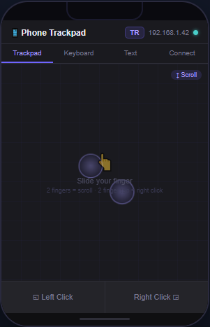
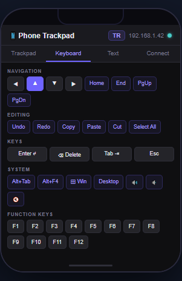
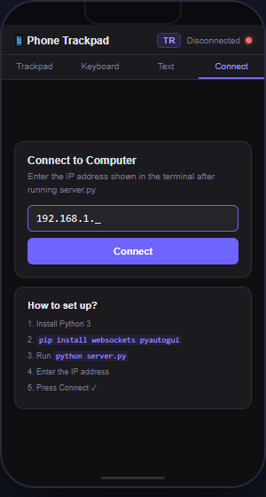

# 📱 Phone Trackpad

**[🇹🇷 Türkçe](#-türkçe) | [🇬🇧 English](#-english)**

---

## 🇹🇷 Türkçe

Telefonunuzu WiFi üzerinden bilgisayarınızın faresi ve klavyesi olarak kullanın. Uygulama yüklemeden, sadece tarayıcıyla çalışır.

  

### ✨ Özellikler

| Özellik | Nasıl Kullanılır |
|---|---|
| 🖱️ Fare hareketi | 1 parmakla kaydır |
| 👆 Sol tık | 1 parmakla tap |
| 🖱️ Çift tık | Hızlı çift tap |
| 👆 Sağ tık | 2 parmakla tap |
| ⚙️ Orta tık | 3 parmakla tap |
| 📜 Scroll | 2 parmakla yukarı/aşağı kaydır |
| 🖱️ Sürükleme | Sol Tık butonuna basılı tut |
| ⌨️ Kısayol tuşları | Klavye sekmesinden |
| ✍️ Metin gönderme | Metin sekmesinden |
| 🌐 Dil değiştirme | Sağ üstteki TR/EN butonundan |

### 🚀 Kurulum

**Gereksinimler:** Python 3.8+ · Telefon ve bilgisayar aynı WiFi ağında olmalı

```bash
# 1. Repoyu klonla
git clone https://github.com/leventeren/Phone-Trackpad.git
cd Phone-Trackpad

# 2. Bağımlılıkları yükle
pip install websockets pyautogui

# 3. Sunucuyu başlat
python server.py          # Mac / Linux
# veya Baslat.bat'a çift tıkla  (Windows)
```

Terminal çıktısında görünen adresi telefonunuzda açın:
```
  🌐 Telefonda aç: http://192.168.1.42:8766
```

### 🖥️ Platform Notları

**Windows** — `Baslat.bat` ile tek tıkla başlatabilirsiniz.

**macOS** — İlk çalıştırmada Accessibility izni gerekir:
`Sistem Tercihleri → Gizlilik ve Güvenlik → Erişilebilirlik → Terminal ✓`

**Linux** — Ekstra bağımlılık gerekebilir:
```bash
sudo apt install python3-tk python3-dev
```

---

## 🇬🇧 English

Use your phone as a wireless mouse and keyboard over WiFi. No app installation needed — works entirely in the browser.

  

### ✨ Features

| Feature | How to Use |
|---|---|
| 🖱️ Mouse movement | Slide one finger |
| 👆 Left click | Single finger tap |
| 🖱️ Double click | Quick double tap |
| 👆 Right click | Two finger tap |
| ⚙️ Middle click | Three finger tap |
| 📜 Scroll | Two finger slide up/down |
| 🖱️ Drag | Hold the Left Click button |
| ⌨️ Keyboard shortcuts | From the Keyboard tab |
| ✍️ Send text | From the Text tab |
| 🌐 Switch language | TR/EN button at top right |

### 🚀 Setup

**Requirements:** Python 3.8+ · Phone and computer on the same WiFi network

```bash
# 1. Clone the repo
git clone https://github.com/leventeren/Phone-Trackpad.git
cd Phone-Trackpad

# 2. Install dependencies
pip install websockets pyautogui

# 3. Start the server
python server.py          # Mac / Linux
# or double-click Baslat.bat  (Windows)
```

Open the address shown in the terminal on your phone:
```
  🌐 Open on phone: http://192.168.1.42:8766
```

### 🖥️ Platform Notes

**Windows** — Double-click `Baslat.bat` to start with one click.

**macOS** — Accessibility permission required on first run:
`System Preferences → Privacy & Security → Accessibility → Terminal ✓`

**Linux** — May need extra dependencies:
```bash
sudo apt install python3-tk python3-dev
```

---

## 🏗️ Architecture

```
Phone (Browser)              Computer (Python)
┌─────────────────┐          ┌──────────────────────┐
│   index.html    │          │      server.py        │
│                 │          │                       │
│  Touch Events   │─WebSocket─▶  pyautogui           │
│  EMA Smoothing  │  :8765   │  Mouse/Keyboard       │
│  Sub-px Scroll  │          │  Control              │
│  TR / EN i18n   │          │                       │
│  HTTP :8766  ◀──────────── │  SimpleHTTPServer     │
└─────────────────┘          └──────────────────────┘
```

### Scroll System

```
touchmove delta
      │
      ▼
EMA Smoother (α=0.45)    ← smooths jitter
      │
      ▼
Sub-pixel Accumulator    ← collects small movements
      │
      ▼ (integer part only)
WebSocket → server.py
      │
      ▼
pyautogui.scroll(clicks)
```

### WebSocket Protocol

```json
{ "action": "move",        "dx": 5.2,  "dy": -3.1 }
{ "action": "scroll",      "dx": 0,    "dy": 2    }
{ "action": "click"                                }
{ "action": "rightclick"                           }
{ "action": "doubleclick"                          }
{ "action": "middleclick"                          }
{ "action": "mousedown"                            }
{ "action": "mouseup"                              }
{ "action": "key",         "key": "enter"          }
{ "action": "hotkey",      "keys": ["ctrl","c"]    }
{ "action": "type",        "text": "hello"         }
```

### File Structure

```
phone-trackpad/
├── server.py         # Python WebSocket + HTTP server
├── index.html        # Phone UI (trackpad + keyboard + text + i18n)
├── Baslat.bat        # Windows one-click launcher
├── README.md
└── screenshots/
    ├── trackpad_tr.png
    ├── keyboard_tr.png
    ├── connect_tr.png
    ├── trackpad_en.png
    ├── keyboard_en.png
    └── connect_en.png
```

## ⚙️ Configuration

`server.py`:
```python
SCROLL_SPEED = 0.4   # Scroll speed multiplier
```

`index.html`:
```javascript
const SMOOTH = 0.45;   // EMA coefficient (0=raw, 1=very smooth)
```

## 📦 Dependencies

| Package | Version | Purpose |
|---|---|---|
| `websockets` | ≥ 10.0 | Real-time communication |
| `pyautogui` | ≥ 0.9.53 | Mouse and keyboard control |

## 📄 License

MIT
